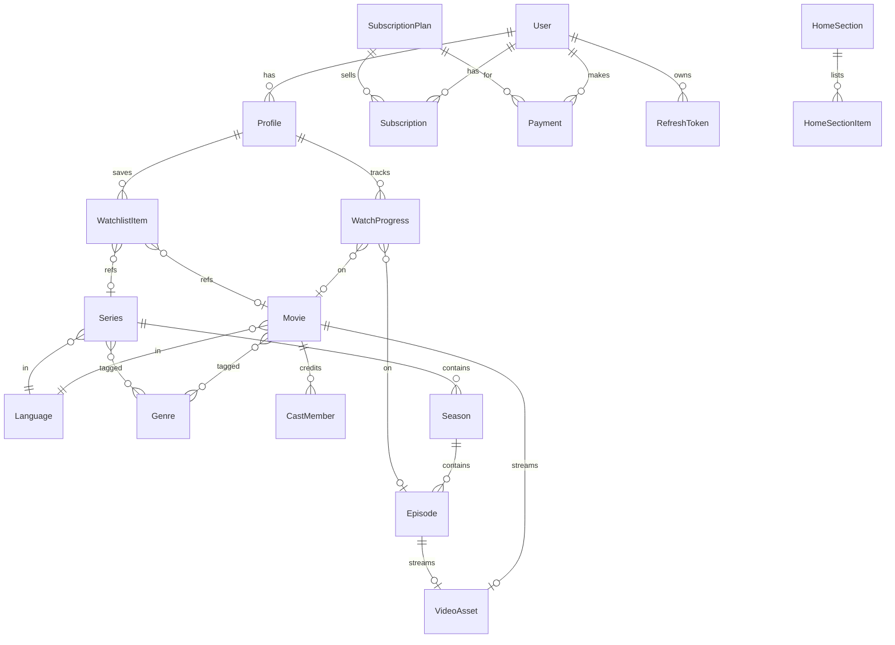

# Masti Malai OTT — Data Model (ERD)

Authoritative schema: [`services/api/prisma/schema.prisma`](../services/api/prisma/schema.prisma).
This is the conceptual view of the Phase-1 core tables.

## Key tables

- **User** — mobile (unique), email?, createdAt. No password (OTP auth).
- **Profile** — belongs to User; `name`, `isKids`, `avatar`, `language`. Multiple per user.
- **RefreshToken** — hashed refresh tokens for rotation/logout + device tracking.
- **SubscriptionPlan** — name, priceInPaise, currency, durationDays, features[], isActive,
  displayOrder, isRecommended, compareAtPriceInPaise? (genuine strike-through only).
- **Subscription** — user, plan, status (`ACTIVE|EXPIRED|CANCELLED|PENDING|FAILED`), startedAt, expiresAt.
- **Payment** — user, plan, orderId, paymentId, amount, currency, status, gatewayMeta (json). Idempotent by orderId.
- **Movie / Series** — CMS fields: slug (unique, indexed), title, description, poster, backdrop,
  trailerUrl, year, durationSec, ageRating, `access` (`FREE|PREMIUM`), status
  (`DRAFT|PROCESSING|SCHEDULED|PUBLISHED|UNPUBLISHED|ARCHIVED`), flags (featured/trending/top10),
  publishAt, SEO fields. Indexed on slug, languageId, status, publishAt.
- **Season / Episode** — episode has number, thumbnail, durationSec, introEndSec, access, VideoAsset.
- **Genre / Language** — reference tables (many-to-many with content).
- **VideoAsset** — status (`UPLOADING|PROCESSING|READY|FAILED`), hlsPath/streamUrl, renditions (json),
  sourcePath. One per movie/episode.
- **HomeSection / HomeSectionItem** — dynamic homepage. Section has title, type
  (`CAROUSEL|TOP10|CONTINUE_WATCHING|HERO`), displayOrder, isActive. Items order content refs.
- **CastMember** — name, role, character, order (attached to movie/series).
- **WatchProgress** — profile + (movieId | episodeId), positionSec, durationSec, updatedAt. Powers
  continue-watching + history.
- **WatchlistItem** — profile + (movieId | seriesId), createdAt.

## Indexes (Phase 1)

`User.mobile`, `Profile.userId`, `Movie.slug/status/languageId/publishAt`,
`Series.slug/status`, `Episode.seasonId`, `WatchProgress.profileId+updatedAt`,
`WatchlistItem.profileId`, `Subscription.userId+status`, `Payment.orderId`.
